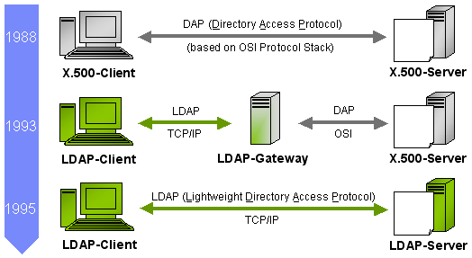
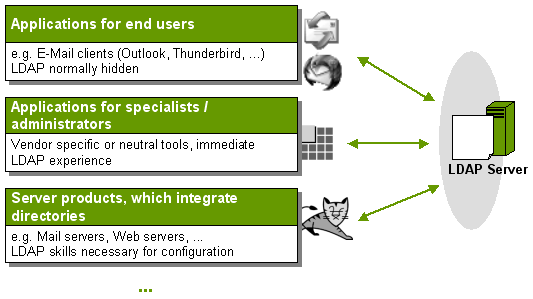

# Apache 目录项目

使用 Java 编写的目录解决方案，包含目录服务器，该项已被 `Open Group` 组织认定为符合 LDAP v3 标准，还有基于 Eclipse 构建的目录工具 `Apache Directory Studio`

## Apache Directory Server （DS）

Apache DS 完全用 Java 编写的目录服务器（可扩展，可嵌入），已被 `Open Group` 组织认定为 LDAPv3 兼容，除了 LDAP，它还支持 `Kerberos 5` 和更改密码协议，它旨在将触发器、存储过程、队列和视图引入缺少这些丰富结构的LDAP世界。

它主要的特点有：

* 被 open group 认证为兼容 LDAPv3 标准
* Kerberos Server Built-in 绑定
* PassWord Policy Support 密码策略支持
* 嵌入 Java 应用：对 Java 开发者友好
* Full X500 Authorization：
* Multi-Master Replication 多副本复制
* 基于 LDIF 配置
* 多平台：支持 Linux, Mac OS X, Windows 等等

### 基本用户指南

LDAP 是一项复杂的技术，Apach DS（Directory Server）不仅仅提供 LDAP 服务，因此我们先通过快速开始来掌握它。

#### 1 如何开始

本示例讲解如何通过最少的配置，让服务器快速的运行

##### 1.1 什么是服务服务

愿景：

* Apache DS 是 LDAP 服务器
* 可嵌入：嵌入到 Java 应用程序中，配置，启动和停止它，可嵌入意味着你可以选择你喜欢的方式部署它
* 可扩展：可以编写自己的分布来存储目录数据，编写拦截器来添加功能
* 符合标准：遵守 LDAPv3 相关的所有 RFC
* 现代化：在遵循标准之上，构建的丰富的集成，例如 LDAP 存储过程和触发器
* 跨平台：完全用 Java 编写，天然具有跨平台能力

体系结构：

起源和动机：

一切的起源来自作者：`Alex Karasulu`

* 他在 2001 年时，意识到 LDAP 目录非常需要丰富的集成层构造，如 LDAP 存储过程，触发器和视图
* 他尝试改变 OpenLDAP 服务器，但是失败了，这个软件很复杂，很脆弱，而且难以管理
* 他开始使用纯 Java 实现一个新的 LDAP 服务器，并且把它捐赠给 Apache 基金会，于是就有了今天这个项目
* 2002 年项目创建注册，基于 Avalon 框架构建
* 2003 年 10 月进入 Apache 孵化器
* 2004 年 10 月成为 Apache 顶级项目
* 2006 年 10 月 Apache DS 作为 Open Group 认证的 LDAP v3 协议服务器发布

参考资源：

* [构建现代 LDAP 文艺复兴 — Apache DS 的愿景](https://directory.apache.org/vision.html)
* [Apache Directory Project 提案](https://directory.apache.org/original-project-proposal.html)

##### 1.2 LDAP 和目录服务的一些背景

本章介绍目录，目录服务，LDAP 的简要概述

目录服务 directory services：

* 目录服务是一组数据存储的集合，用于向需要的人提供和展示集合数据
* 目录服务兼顾结构化存储和高效的检索（天生自带树形结构）实现，它特点如下：
  * 所有数据存储在 `entry` 中
  * 目录中的一组条目形成一个树（分层数据库）
* 目录服务通过明确定义的接口，提供目录内容的访问，LDAP 则是访问目录服务的协议

目录服务和数据库通常不是竞争关系，而是两者共存，可以参考这篇文章：[Should I Use a Directory, a Database, or Both? (novell.com)](https://support.novell.com/techcenter/articles/ana20011101.html)

轻量级目录访问协议（LDAP） Lightweight Directory Access Protocol

* 早在 1988 年定稿的 x.500 标准，奠定了访问目录服务的标准（基于 DAP ）
* 随时互联网的发展，基于 TCP/IP 的访问方法（通过 LDAP-Gateway 实现） LDAP 被标准化
* 最后 LDAP-Server 完全替代 X.500-Server

以下是 LDAP 协议的发展历史，从 X.500 ~ LDAP：

那么关于 X.500 协议为什么被弃用 ？原因如下：

> X.500 虽然是一个功能强大的分布式目录服务系统，但由于其复杂的架构和高昂的成本，它并不是所有组织都能轻松采用的。随着互联网的发展和 LDAP 技术的成熟，许多组织开始采用基于 LDAP 的目录服务器，如 OpenLDAP 和 ApacheDS 等。这些解决方案通常更加简单、易用和经济，可以满足大多数组织的目录服务需求。因此，X.500 目录服务器的使用已经逐渐减少，并最终被弃用。

LDAP 的几个关键概念：

* Entry：
  * 所有数据存储在 Entry 中，这些 Entry 构建了一个分层的树状结构
  * 每个 Entry 都有一个唯一的名字叫：DN，用于描述 Entry 在树中的位置
  * Entry 由 K-V 键值对组成，有些属性可以出现多次，例如 phoneNumber
* objectClass：
  * 定义 Entry 中有哪些属性，哪些属性是必须的
  * 构建一个以 `top` 为根的 objectClass 层次结构
* Schema
  * 由 objectclass 和 attributeType 组成，可以定义目录中可以存储哪些 Entry
  * 目录服务器通常都会提供默认的 Schema，它通过 RFCs 标准实现，在实践中，基于预设的元素，基本都能满足要求
  * 大多数目录服务器都会允许你自定义 objectClass 和 attribute

LDAP 的最佳实践：

* LDAP 提供增删改查的操作，并且对读取和搜索进行的优化，但牺牲了写入的性能
* 如果你的目录数据经常发生修改，则更加适合关系型数据库，且能得到更好的事务支持
* 目录服务器产品都内置了多副本功能，这为目录服务提供的更好的可用性

常见的支持 LDAP 的软件：

* 电子邮件客户端（例如 Mozilla Thunderbird）
* LDAP 工具（例如 Apache Directory Studio）
* Web 服务器（例如 Apache Tomcat、Apache HTTP Server）
* 邮件服务器（例如Apache James）
* …………

图例：

更多资源：

* LDAP 专家 Neil Wilson Blog：[dc=nawilson,dc=com | LDAP, programming](https://nawilson.com/)
* 书籍：[Understanding LDAP - Design and Implementation (ibm.com)](https://www.redbooks.ibm.com/abstracts/SG244986.html?Open)
* 书籍：[LDAP verstehen mit linx](http://www.mitlinx.de/ldap/)

##### 1.3 安装和开始服务

安装条件：

* java 8
* 适用于任意平台的 `tar`， `zip` 安装路径：[Downloads — Apache Directory](https://directory.apache.org/apacheds/downloads.html)
* 自己从源代码中构建服务：[Building Trunks — Apache Directory](https://directory.apache.org/apacheds/advanced-ug/0.2-building-trunks.html)

### 高级用户指南

### 开发指南

### Kerberos 用户指南

### 配置参考

### Java 文档

### 参考文档

## Apache Directory Studio

Apache Directory Studio 是一个目录服务工具，特别适用于 ApacheDS，它是一个 Eclipse RCP 应用程序，由 Eclipse OSGI 插件组成，这些插件可以轻松升级，这些插件运行在 Eclipse 内部

## Apache LDAP API

Version：

* 1.0.3
* 2.1.2

The Apache Directory LDAP API is an ongoing effort to provide an enhanced LDAP API, as a replacement for JNDI and the existing LDAP API (jLdap and Mozilla LDAP API). This is a "schema aware" API with some convenient ways to access all types of LDAP servers, not only ApacheDS but any LDAP server. The API is OSGI ready and extensible. New controls, schema elements and network layer could be added or used in the near future.

LDAP API （主要还是用于 ApacheDS），Spring 也有类型的 LDAP RestTemplate

## Apache Mavibot

Mavibot™ is a *Multi Version Concurrency Control* (MVCC) BTree in Java. It is expected to be a replacement for JDBM (The current backend for the Apache Directory Server), but could be a good fit for any other project in need of a Java MVCC BTree implementation.

Mavibot 是 Java 中的多版本并发控制（MVCC）BTree。它有望取代JDBM（Apache Directory Server的当前后端），但可能非常适合需要Java MVCC BTree实现的任何其他项目。

## Apache Kerby

Apache Kerby™ is a Java Kerberos binding. It provides a rich, intuitive and interoperable implementation, library, KDC and various facilities that integrates PKI, OTP and token (OAuth2) as desired in modern environments such as cloud, Hadoop and mobile.

Apahce Kerby 是 Java Kerberos 绑定。它提供了丰富、直观和可互操作的实现、库、KDC和各种设施，可根据现代环境（如云、Hadoop和移动）的需要集成PKI、OTP和令牌（OAuth2）。

## Apache Fortress

Apache Fortress™ is a standards-based authorization system that provides attribute and role-based access control, delegated administration and password policy services using an LDAP backend.

Apache Fortress 是一个基于标准的授权系统，它使用 LDAP 后端提供属性和基于角色的访问控制、委派管理和密码策略服务。

