# Apache DS 基本使用指南

Apache DS 完全用 Java 编写的目录服务器（可扩展，可嵌入），已被 `Open Group` 组织认定为 LDAPv3 兼容，除了 LDAP，它还支持 `Kerberos 5` 和更改密码协议，它旨在将触发器、存储过程、队列和视图引入缺少这些丰富结构的LDAP世界。


它主要的特点有：

* 被 open group 认证为兼容 LDAPv3 标准
* Kerberos Server Built-in 绑定
* PassWord Policy Support 密码策略支持
* 嵌入 Java 应用：对 Java 开发者友好
* Full X500 Authorization：
* Multi-Master Replication 多副本复制
* 基于 LDIF 配置
* 多平台：支持 Linux, Mac OS X, Windows 等等


LDAP 是一项复杂的技术，Apach DS（Directory Server）不仅仅提供 LDAP 服务，因此我们先通过快速开始来掌握它。


## 1：快速开始

本示例讲解如何通过最少的配置，让服务器快速的运行


### 什么是目录服务 ？

Apache DS 的愿景：

* Apache DS 是 LDAP 服务器
* 可嵌入：嵌入到 Java 应用程序中，配置，启动和停止它，可嵌入意味着你可以选择你喜欢的方式部署它
* 可扩展：可以编写自己的分布来存储目录数据，编写拦截器来添加功能
* 符合标准：遵守 LDAPv3 相关的所有 RFC
* 现代化：在遵循标准之上，构建的丰富的集成，例如 LDAP 存储过程和触发器
* 跨平台：完全用 Java 编写，天然具有跨平台能力


体系结构：


起源和动机，一切的起源来自作者：`Alex Karasulu` ：

* 他在 2001 年时，意识到 LDAP 目录非常需要丰富的集成层构造，如 LDAP 存储过程，触发器和视图
* 他尝试改变 OpenLDAP 服务器，但是失败了，这个软件很复杂，很脆弱，而且难以管理
* 他开始使用纯 Java 实现一个新的 LDAP 服务器，并且把它捐赠给 Apache 基金会，于是就有了今天这个项目
* 2002 年项目创建注册，基于 Avalon 框架构建
* 2003 年 10 月进入 Apache 孵化器
* 2004 年 10 月成为 Apache 顶级项目
* 2006 年 10 月 Apache DS 作为 Open Group 认证的 LDAP v3 协议服务器发布


参考资源：

* [构建现代 LDAP 文艺复兴 — Apache DS 的愿景](https://directory.apache.org/vision.html)
* [Apache Directory Project 提案](https://directory.apache.org/original-project-proposal.html)


### LDAP 和目录服务介绍

本章介绍目录，目录服务，LDAP 的简要概述


目录服务 directory services：

* 目录服务是一组数据存储的集合，用于向需要的人提供和展示集合数据
* 目录服务兼顾结构化存储和高效的检索（天生自带树形结构）实现，它特点如下：
  * 所有数据存储在 `entry` 中
  * 目录中的一组条目形成一个树（分层数据库）
* 目录服务通过明确定义的接口，提供目录内容的访问，LDAP 则是访问目录服务的协议


目录服务和数据库通常不是竞争关系，而是两者共存，可以参考这篇文章：[Should I Use a Directory, a Database, or Both? (novell.com)](https://support.novell.com/techcenter/articles/ana20011101.html)


轻量级目录访问协议（LDAP） Lightweight Directory Access Protocol

* 早在 1988 年定稿的 x.500 标准，奠定了访问目录服务的标准（基于 DAP ）
* 随时互联网的发展，基于 TCP/IP 的访问方法（通过 LDAP-Gateway 实现） LDAP 被标准化
* 最后 LDAP-Server 完全替代 X.500-Server


以下是 LDAP 协议的发展历史，从 X.500 ~ LDAP：


那么关于 X.500 协议为什么被弃用 ？原因如下：

> X.500 虽然是一个功能强大的分布式目录服务系统，但由于其复杂的架构和高昂的成本，它并不是所有组织都能轻松采用的。随着互联网的发展和 LDAP 技术的成熟，许多组织开始采用基于 LDAP 的目录服务器，如 OpenLDAP 和 ApacheDS 等。这些解决方案通常更加简单、易用和经济，可以满足大多数组织的目录服务需求。因此，X.500 目录服务器的使用已经逐渐减少，并最终被弃用。


LDAP 的几个关键概念：

* Entry：
  * 所有数据存储在 Entry 中，这些 Entry 构建了一个分层的树状结构
  * 每个 Entry 都有一个唯一的名字叫：DN，用于描述 Entry 在树中的位置
  * Entry 由 K-V 键值对组成，有些属性可以出现多次，例如 phoneNumber
* objectClass：
  * 定义 Entry 中有哪些属性，哪些属性是必须的
  * 构建一个以 `top` 为根的 objectClass 层次结构
* Schema
  * 由 objectclass 和 attributeType 组成，可以定义目录中可以存储哪些 Entry
  * 目录服务器通常都会提供默认的 Schema，它通过 RFCs 标准实现，在实践中，基于预设的元素，基本都能满足要求
  * 大多数目录服务器都会允许你自定义 objectClass 和 attribute


LDAP 的最佳实践：

* LDAP 提供增删改查的操作，并且对读取和搜索进行的优化，但牺牲了写入的性能
* 如果你的目录数据经常发生修改，则更加适合关系型数据库，且能得到更好的事务支持
* 目录服务器产品都内置了多副本功能，这为目录服务提供的更好的可用性


常见的支持 LDAP 的软件：

* 电子邮件客户端（例如 Mozilla Thunderbird）
* LDAP 工具（例如 Apache Directory Studio）
* Web 服务器（例如 Apache Tomcat、Apache HTTP Server）
* 邮件服务器（例如Apache James）
* …………


图例：


更多资源：

* LDAP 专家 Neil Wilson Blog：[dc=nawilson,dc=com | LDAP, programming](https://nawilson.com/)
* 书籍：[Understanding LDAP - Design and Implementation (ibm.com)](https://www.redbooks.ibm.com/abstracts/SG244986.html?Open)
* 书籍：[LDAP verstehen mit linx](http://www.mitlinx.de/ldap/)


### 安装和开始

安装条件：

* java 8
* 适用于任意平台的 `tar`， `zip` 安装路径：[Downloads — Apache Directory](https://directory.apache.org/apacheds/downloads.html)
* 自己从源代码中构建服务：[Building Trunks — Apache Directory](https://directory.apache.org/apacheds/advanced-ug/0.2-building-trunks.html)


### 基本配置

#### 修改运行端口

LDAP 的运行端口：

* LDAP 服务器的默认端口分别是：10389（未加密），10636（SS）
* LDAP 的常见端口是 389，你可以把端口修改为 389（注意：UNIX 非根进程必须监听大于 1023 的端口）


修改端口的两种方式：

使用 `Apache Directory Studio` 的配置页面即可修改端口


在修改配置 LDIF 分区设置，其中 DN 路径为: `ou=transports，ads-serverId=ldapServer*，ou=servers，ads-directoryServiceId=default，ou=config`


#### 修改管理员密码

主要有以下 4 个步骤：

1. 通过客户端工具和默认账号 `uid=admin，ou=system/secret` 登录 LDAP
2. 找到树中的 `userPassword` 属性的值
3. 然后输入密文和哈希算法，点击 `OK` 保存即可
4. 最后使用新密码登录进行验证


选择属性

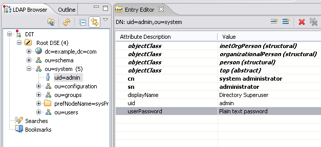

编辑，修改密码：


保存即可


#### 添加分区 partition

什么是分区（partition） ？

* 所有 entry 存储在分区 partition 中，每个分区包含一个完整的 Entry Tree，也称 DIT
* 也有可能存在多个分区，但是分区中的 Entry 彼此完全不会相互影响
* 识别 Entry 的分区，通过 Entry DN 路径上下文即可
* 分区默认实现基于 JDBM B+ Tree
* Apache DS 将其信息存储在特殊的分区中，分别为：`ou=schema`、`ou=config`、`ou=system`


Apache DS 默认配置包含一个后缀为 `dc=example, dc=com` 的分区，如图：


最小分区定义：

通过 ApacheDS 的配置页面的 `Partitions` 标签，你可以添加自己的分区，如图：


重启服务器后，即可看见新创建的分区：


你还可以通过编程的方式创建分区：

```java
// Get the SchemaManager, we need it for this addition
SchemaManager schemaManager = directoryService.getSchemaManager();

// Create the partition
JdbmPartition sevenseasPartition = new JdbmPartition( schemaManager );
sevenseasPartition.setId("sevenseas");
Dn suffixDn = new Dn( schemaManager, "o=sevenseas" );
sevenseasPartition.setSuffix( suffixDn );
sevenseasPartition.setCacheSize(1000);
sevenseasPartition.init(directoryService);
sevenseasPartition.setPartitionPath( <a path on your disk> );

// Create some indices (optional)
sevenseasPartition.addindex( new JdbmIndex( "objectClass", false ) );
sevenseasPartition.addindex( new JdbmIndex( "o", false ) );

// Initialize the partition
sevenseasPartition.initialize();

// create the context entry
Entry contextEntry = new DefaultEntry( schemaManager, "o=sevenseas",
    "objectClass: top", 
    "objectClass: organization",
    "o: sevenseas" );

// add the context entry
sevenseasPartition.add( new AddOperationContext( null, entry ) );

// We are done !
```


关于分区的更多配置选项：

|           属性           |             描述              |    默认值     | 必须 |
| :----------------------: | :---------------------------: | :-----------: | :--: |
|     ads-partitionId      |         分区唯一标识          |      N/A      | yes  |
|   ads-partitionSuffix    |           分区示例            |      N/A      | yes  |
|     ads-contextEntry     |          entry 内容           |   自动推断    |  no  |
|   ads-optimizerEnabled   |          打开优化器           |     true      |  no  |
|  ads-partitionCacheSize  | 缓存大小 (仅应用于 JDBM 分区) | -1 (no cache) |  no  |
| ads-partitionSyncOnWrite |       每次写入同步磁盘        |     true      |  no  |


#### 配置日志

调整服务器日志级别，可以有效的检测和分析问题，这里介绍如何在 Apache DS 中配置日志

* Apache DS 2.0 使用 SLF4J 作为日志的解决方案
* 默认情况下，Apache DS 将日志写入 `<APACHE_HOME>/var/log` 目录中
* 默认配置文件 `log4j.properties` 位于 `<APACHE_HOME>/conf` 目录中


日志配置文件如下：

|          属性名          |              值               |                 释义                 |
| :----------------------: | :---------------------------: | :----------------------------------: |
|           File           |     apacheds-rolling.log      | 日志文件输出路径：默认是： *var/log* |
|       MaxFileSize        |            1024KB             |          日志文件滚动的大小          |
|      MaxBackupIndex      |               5               |           保留备份的文件数           |
| layout.ConversionPattern | [%d{HH:mm:ss}] %p [%c] - %m%n |         记录事件的格式字符串         |

备注：如果日志配置不符合你的要求，你可以随时修改它


日志级别，Apache DS 对于日志级别的定义：

| 级别  |                 描述定义                 |
| :---: | :--------------------------------------: |
| DEBUG |    细粒度：对调试应用程序最有用的事件    |
| INFO  |    粗粒度：显示应用程序进度的信息消息    |
| WARN  |     警告：程序发生潜在有害信息时输出     |
| ERROR | 错误：程序发生错误事件，但仍可持续的运行 |
| FATAL | 致命的：导致程序终止的非常严重的错误事件 |

默认日志级别为 WARN，你可以这样修改它：

```properties
# 改为 DEBUG
log4j.rootCategory=DEBUG, stdout, R
```


其他示例：

你可以通过以下配置，记录所有传入的增删改查请求：

```properties
log4j.logger.org.apache.directory.server.ldap.handlers.SearchHandler=DEBUG
log4j.logger.org.apache.directory.server.ldap.handlers.AddHandler=DEBUG
log4j.logger.org.apache.directory.server.ldap.handlers.DeleteHandler=DEBUG
log4j.logger.org.apache.directory.server.ldap.handlers.ModifyHandler=DEBUG
log4j.logger.org.apache.directory.server.ldap.handlers.ModifyDnHandler=DEBUG
```


参考资料：

* [Short introduction to log4j](https://logging.apache.org/log4j/1.2/manual.html)


#### 启用匿名访问

默认情况下会开启允许匿名访问，你可以通过以下方式改变它：

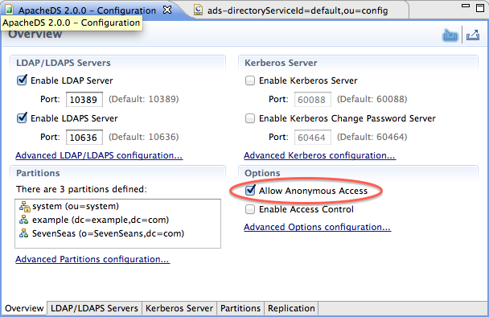

备注：修改后需要重启服务器

该功能启用和停用主要区别如下：

* 启用匿名访问：无需任何身份认证即可访问 LDAP 服务
* 关闭匿名访问：需要提供有效的身份信息才能访问 LDAP 服务


### 目录数据示例

实际操作的几个注意事项：

* 导入前请确保已将后缀 `o=sevenSeas` 的分区添加到服务器，为了提高辨识度，你可以添加自己的分区
* 你可以使用任意一种实现 LDAP 协议的客户端，LDAP 的情况要比 HTTP 好一些，因为它没有浏览器大战
* 你可以在官网 [apache-ds-tutorial.ldif](https://directory.apache.org/apacheds/basic-ug/resources/apache-ds-tutorial.ldif) 找到示例数据的 LDIF 样本，并且导入你的目录服务中
* LDIF 文件是 LDAP 协议的数据交换格式，在 LDAP 世界被广泛采用，并且在 [RFC 2849](http://www.faqs.org/rfcs/rfc2849.html) 中标准化
* 你可以将标准化的 LDIF 文件导入到任意的目录服务中，不仅仅是 Apache DS 目录服务


以上示例文件导入效果如下，在结构树中，人员和群组通过 `ou=people`,`ou=groups` 进行了区分：


### 备份/恢复

Apache DS 所有数据文件都是二进制文件，你不能简单的复制这些文件，因为存在数据状态和一致性的问题

当前的解决方案如下：

通过 Apache  Directory Studio 工具或者 ldapsearch 脚本，在你感兴趣的分区进行以下操作

* 在你需要备份的分区中提取 LDIF 文件
* 在你需要恢复的分区中导入 LDIF 文件


## 2：处理目录的数据

服务启动后，可以增删改查 Entry，并且可以修改和管理 Schema，对其扩展，来满足你的需求


### 数据修改

本章仅做简单介绍，查看更多信息，请参考以下文档：

* [Welcome to Apache Directory LDAP API — Apache Directory](https://directory.apache.org/api/index.html)
* [User's Guide — Apache Directory](https://directory.apache.org/studio/users-guide.html)


#### 添加 Entry

添加 Entry 很简单，步骤如下：

1. 创建 LDIF 文件，选择你要添加的分区（必须存在）
2. 选择合适的工具导入它，使用 `ldapmodify` 命令或者 Apache Directory Studio，或者 LDAP API 等等


一个示例的 LDIF 文件如下：

```sh
# 添加到刚才创建的 parttion 中
dn: ou=people,o=sevenSeas
objectclass: organizationalUnit
objectclass: top
ou: people

dn: cn=James Hook,ou=people,o=sevenSeas
objectclass: inetOrgPerson
objectclass: organizationalPerson
objectclass: person
objectclass: top
cn: James Hook
description: A pirate captain and Peter Pan's nemesis
sn: Hook
mail: jhook@neverland
userpassword: peterPan
```


使用命令行创建：

```sh
$ ldapmodify -h zanzibar -p 10389 -D "cn=Horatio Nelson,ou=people,o=sevenSeas" -w pass \\
    -a -f captain_hook.ldif
adding new entry cn=James Hook,ou=people,o=sevenSeas

# 创建成功后，再来搜索它进行验证
$ ldapsearch -h zanzibar -p 10389 -b "o=sevenSeas" -s sub "(cn=James Hook)" +
version: 1
dn: cn=James Hook,ou=people,o=sevenSeas
accessControlSubentries: cn=sevenSeasAuthorizationRequirementsACISubentry,o=sevenSeas
creatorsName: cn=Horatio Nelson,ou=people,o=sevenSeas
createTimestamp: 20061203140109Z
```


使用 Apche Directory Studio 导入示例：


然后选择文件进行导入：

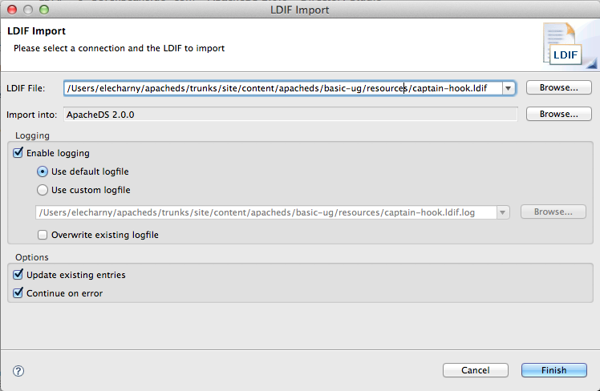


#### 删除 Entry

删除 Entry 的 3 个基本条件，才能开展下一步工作：

* Entry 必须存在
* Entry 不能有任何子节点（Studio 会帮你进行递归删除， LDAP 请求则不会）
* 操作删除的用户需要具备足够的权限


命令行工具删除：

使用 LDIF 文件声明操作类型：

```sh
# File captain_hook_delete.ldif
dn: cn=James Hook,ou=people,o=sevenSeas
changetype: delete
```

然后使用命令行工具：

```sh
$ ldapdel -h zanzibar -p 10389 -D "cn=Horatio Nelson,ou=people,o=sevenSeas" -w pass \\
    -a -f captain_hook.ldif deleting entry cn=James Hook,ou=people,o=sevenSeas
```


使用 Apache Directory Studio 删除：

选择要 Entry，右键删除即可：


注意：Studio 允许删除 Entry 含有子节点的情况，它会尝试递归删除所有子节点


### 搜索数据

搜索是 LDAP 执行最多的操作，LDAP 的搜索都经过优化，以便尽可能快的搜索到结果

#### 简单搜索

一个简单的搜索示例：

```sh
$ ldapsearch -h zanzibar -p 10389 -b "o=sevenSeas" -s sub "(cn=James Hook)" +
version: 1
dn: cn=James Hook,ou=people,o=sevenSeas
accessControlSubentries: cn=sevenSeasAuthorizationRequirementsACISubentry,o=sevenSeas
creatorsName: cn=Horatio Nelson,ou=people,o=sevenSeas
createTimestamp: 20061203140109Z
```

搜索示例总结：

* 通过命令行连接到 zanzibar 服务器上进行匿名搜索（服务器允许的话）
* 搜索命令：sevenSeas 分区，搜索条件是：`cn=James Hook` 的 Entry，搜索范围是 `sub`
* 最后一个参数 `+` 要求服务器返回所有操作属性


#### 更多搜索选项

* Apache Directory Server 默认不启用匿名搜索（安全问题，搜索前先完成认证）
* LDAP filter 非常复杂，和 SQL 不同，它们甚至没有 JOIN 功能
* 查询符号：常用的分别是：and, or, not
* 查询作用域：常用的分别是：OBJECT，ONELEVEL，SUBLEVEL
* 指定返回属性：搜索可以指定返回的属性，可以通过以下方式设定：
  * `*` 返回所有用户属性
  * `+` 返回所有操作属性
  * 属性名称列表
  * 


常用查询符合和示例：

| Connector |               描述                |              Example              |
| :-------: | :-------------------------------: | :-------------------------------: |
|    And    |     所有结果值的条件都为 true     | (&(objectClass=person)(cn=acme))  |
|    Or     | 计算出的结果值，条件满足 1 项即可 | (\|(objectClass=person)(cn=acme)) |
|    Not    |     计算出不等于该条件的结果      |      (!(objectClass=person))      |

常用的查询运算符：

|      Filter      |
| :--------------: |
|   = (Equality)   |
|    Substring     |
|        >=        |
|        <=        |
|   =* (Present)   |
| ~= (ApproxMatch) |
| extensibleMatch  |


### Schema 介绍

* LDAP 中的所有数据都是根据 Schema的结构存储，类似数据库的表和字段
* Apache DS 有一个动态模式，可以修改模式而无需重启服务器（将在高级用户指南中详细讲解）


Schema 是一组定义可以存储在服务器中的数据结构的元素，它定义了以下元素：

* AttributeType：可以存储在属性中值的类型
* ObjectClass：可以定义属性的集合和必须存在的值
* Syntax：必须遵守的语法规则
* MatchingRule：用于检索数据的规则


Apache DS 提供预定义的 Schema，应该能满足大部分用户的需求，你可以使用 Apache Directory Studio 浏览现有模式（关于扩展 Schema 将在高级用户指南中详细讲解）：

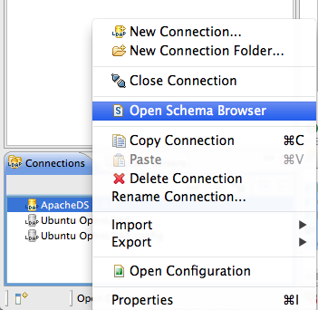

然后在 Schema Browser 中查看和检索：


#### 添加 Schema

>问题：是否总需要自定义 schema elements ?
>
>回答：答案是否定的，大多数的目录服务都附带一组预定义的，标准化模式，只使用预定义的模式是很常见的

##### 浏览 Schema

Apache DS 的 Schema 子系统将 Schema 元素存储为 DIT 的条目，可以在 `ou=schema` 特殊分区中找到它们：

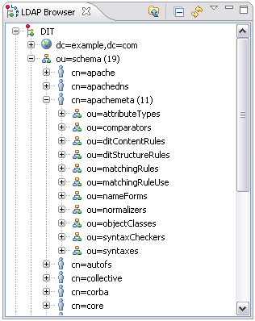


##### 使用 OID

* OID 由一系列数字组成的字符串，这些数字由点分隔，如 `12.4.1971.0.1`，这种独特的方式标识对象，避免名称冲突
* OID 是分层分配的，并且在世界范围内独一无二
* `1.3.6.1.4.1` 开头的 OID 代表 IANA 注册的私有企业
* `1.3.6.1.4.1.18080.0` 已由 ASF 分配给 Apache Directory 项目
* `1.3.6.1.4.1.18080.0.4.3` 作为文档中示例的 schema elements 
* 和 SSL 自签名证书一样，如果要在生产环境使用 OID，应该提前申请 OID （通过个人身份和企业身份申请）

> 你可以在 [IANA | Change Request](https://www.iana.org/assignments/enterprise-numbers/assignment/apply/) 处申请 OID，一般需要几周的时间


##### 简单的示例

以下是我们要添加的 Entry，它的 objectClass 为 `ship`，包含一个 `numberOfGuns` 属性，如下：

```sh
dn: cn=HMS Victory,ou=ships,o=sevenSeas
objectClass: top
objectClass: ship
cn: HMS Victory
numberOfGuns: 104
description: a ship of the line of the Royal Navy
description: built between 1759 and 1765
```

Apache DS 预定义的模式中没有我们需要的类和属性，我们通过自定义模式，来让它满足需求，先添加 `numberOfGuns` 属性类型，下面是根据 RFC 4512 格式化的自定义属性类型 numberOfGuns 的定义：

```sh
( 1.3.6.1.4.1.18060.0.4.3.2.1 
 NAME 'numberOfGuns'  DESC 'Number of guns of a ship'
 EQUALITY integerMatch SYNTAX 1.3.6.1.4.1.1466.115.121.1.27 
 SINGLE-VALUE 
)
```

然后是自定义 ship 对象：

```sh
( 1.3.6.1.4.1.18060.0.4.3.3.1 
 NAME 'ship' DESC 'An entry which represents a ship' 
 SUP top STRUCTURAL 
 MUST cn MAY ( numberOfGuns $ description ) 
)
```

最终我们定义的 `sevenSeas.schema` 文件如下：

```sh
attributetype ( 1.3.6.1.4.1.18060.0.4.3.2.1 
        NAME 'numberOfGuns' 
        DESC 'Number of guns of a ship'
        EQUALITY integerMatch
        SYNTAX 1.3.6.1.4.1.1466.115.121.1.27 
        SINGLE-VALUE 
 )
 
objectclass ( 1.3.6.1.4.1.18060.0.4.3.3.1 
        NAME 'ship'
        DESC 'An entry which represents a ship' 
        SUP top 
        STRUCTURAL 
        MUST cn 
        MAY ( numberOfGuns $ description ) 
 )
```


使用 Apache Directory Studio 加载新的 Schema 元素

步骤如下：

打开 Schema 编辑器，创建新的 Schema Project（或者在现有的 Apache DS 中选择 Schema Project）：


然后单机创建，选择创建 Schema：

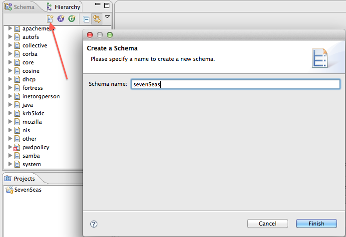

然后将我们创建的 schema 导出为 LDIF 文件：


最后，将导出的 LDIF 模式文件导入到 Apache DS 即可：

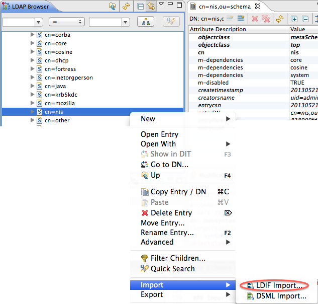

最后在 Apache DS 中应该已经支持你创建的 schema 类和属性


#### 启用 Schema 

这里的文档重复了。。。


## 3：基本安全

这里介绍最简单的身份验证，授权和 SSL

### 3.1 身份验证选项

#### 身份认证介绍

* 对客户端的身份进行验证，并且检查其拥有的操作权限
* Apache DS 支持简单的身份验证，匿名访问
* Apache DS 在用户的 userPassword 属性中存储密码，可以是明文，MD5 或者 SHA 1 等哈希算法进行单向加密


#### 简单的身份绑定流程

* LDAP 客户端向服务器提供用户条目的 DN 和密码，以及绑定操作的参数
* Apache DS 检查给定的密码与存储在给定的 userPassword 属性中密码相同
* 密码匹配成功则完全验证，匹配失败则抛出 LDAP_INVALID_REDENTIALS 用户身份未通过验证


使用命令行工具进行用户身份绑定，绑定失败示例：

```sh
$ ldapsearch -h zanzibar -p 10389 -D "cn=Horatio Hornblower,ou=people,o=sevenSeas" \\
    -w wrong -b "ou=people,o=sevenSeas" -s base "(objectclass=*)"
ldap_simple_bind: Invalid credentials
ldap_simple_bind: additional info: Bind failed: null
```

如果提供正确的密码，绑定成功后再进行搜索的操作：

```sh
$ ldapsearch -h zanzibar -p 10389 -D "cn=Horatio Hornblower,ou=people,o=sevenSeas" \\
    -w pass -b "ou=people,o=sevenSeas" -s base "(objectclass=*)"
version: 1
dn: ou=people,o=sevenSeas
ou: people
description: Contains entries which describe persons (seamen)
objectclass: organizationalUnit
objectclass: top
```


#### 密码存储

LDAP 会将密码进行单向的哈希加密存储（不会明文存储），例如：

```sh
dn: cn=Horatio Hornblower,ou=people,o=sevenSeas
objectclass: person
objectclass: organizationalPerson
cn: Horatio Hornblower
sn: Hornblower
userpassword: {SHA}nU4eI71bcnBGqeO0t9tXvY1u5oQ=
...
```

可以看到 `userpassword` 字段是通过安全哈希算法加密计算后存储的


在使用 Apache Directory Studio 对用户密码进行添加修改时，也可以选择对应的哈希算法：


> 风险：
>
> * 单向加密只会有限的增加安全性，在绑定操作期间，如果未使用 SSL/TLS 通信，则凭据信息扔有可能被窃取
> * LDIF 文件也包含用户的明文密码


#### 匿名访问

允许匿名访问并不罕见，如果足够信任客户端，并且数据不敏感的话，是会允许这样操作的

示例 1：匿名访问被禁用的情况

```sh
$ ldapsearch -h zanzibar -p 10389 -b "ou=people,o=sevenSeas" -s one "(objectclass=*)"
ldap_search: Insufficient access
ldap_search: additional info: failed on search operation: Anonymous binds have been disabled!
```

示例 2：匿名访问被允许的情况

```sh
$ ldapsearch -h zanzibar -p 10389 -b "ou=people,o=sevenSeas" -s base "(objectclass=*)"
version: 1
dn: ou=people,o=sevenSeas
ou: people
description: Contains entries which describe persons (seamen)
objectclass: organizationalUnit
objectclass: top
```

示例 3：使用 Apache Directory Studio 匿名访问：

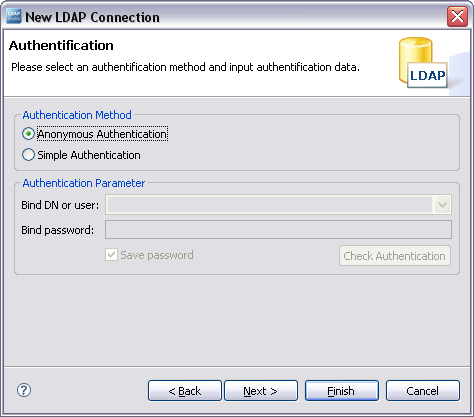


通过 uid 验证

DN 太长，通常无法被用户记录，使用 Entry 中的的 `uid` 属性则方便很多

示例：使用 uid 进行身份认证：

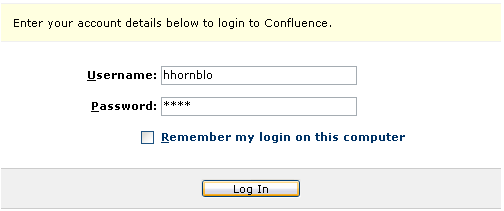


### 3.2 基本授权


LDAP 的授权：

* 在 LDAP 的世界中，目录操作的授权没有严格的标准化，每个产品都有自己的授权功能，Apache DS 也是如此
* Apache DS 从 `0.9.3` 开始，提供了一个强大的授权子系统，但默认禁用
* 通常通过 group 来实现（groupOfNames 和 groupOfUniqueNames）授权功能


#### ACI 访问控制项

通过 ACI = Access Control Item 可以实现更灵活的操作控制，满足更多需求，它默认是关闭的，我们可以启用它：


我们将利用 ACI 让它满足我们如下需求：

* 后缀 `o=sevenSeas` 用作访问控制特定区域
* 用户 `Horatio Nelson` 能够在 `o=seven seas` 下执行所有操作
* 其他和匿名用户只能搜索和比较
* 其他和匿名用户无法读取 userPassword 属性


关于 ACI 的文件定义参考：[3.2 - Basic authorization — Apache Directory](https://directory.apache.org/apacheds/basic-ug/3.2-basic-authorization.html)

* 它展示了如何定义 ACI 文件，并且应用在特定用户身上
* 并且使用 entry 的增删改查作为操作权限的验证示例


本章资源：

- [Practices in Directory Groups](http://middleware.internet2.edu/dir/groups/docs/internet2-mace-dir-groups-best-practices-200210.htm) describes how to use groups within LDAP directories. Highly recommended.
- The [ApacheDS v2.0 Advanced User’s Guide](https://directory.apache.org/apacheds/advanced-user-guide.html) provides a detailed authorization chapter
- [RFC 2849](https://www.faqs.org/rfcs/rfc2849.html) The LDAP Data Interchange Format (LDIF) is used extensively in this section


#### 如何开启 SSL

在 LDAP  中开启 SSL 的两种方法：

* ldaps （LDAP over SSL/TLS，通常在端口 636 上）
* 启动 TLS 扩展操作

以上两种方法都需要使用适当的证书配置服务器

> LDAPS 已经被弃用，您应该始终支持 startTLS


启用 SSL 配置：

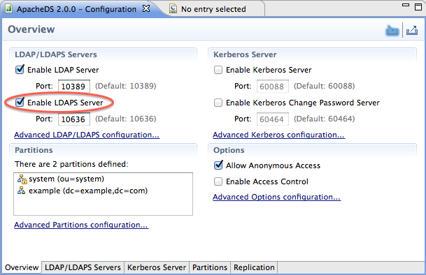


创建证书的三种方式：

* 从证书颁发机构购买证书，或者从企业 CA 获取证书
* 要求 [CACERT organisation](http://www.cacert.org/) 组织免费提供证书
* 自己创建自签名证书，该证书将不受信任（你可以选择 JDK 的 keytool 工具创建）


使用 JDK keytool 创建数字证书：

```sh
keytool -genkey -keyalg "RSA" -dname "cn=zanzibar, ou=ApacheDS, o=ASF, c=US" \\
    -alias zanzibar -keystore zanzibar.ks -storepass secret -validity 730
```


或者可以选择使用 [Portecle](https://portecle.sourceforge.net/) 等图形工具创建密钥：

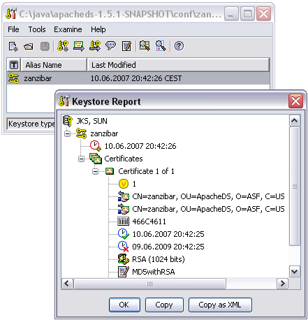


配置 Apache DS 使用外部密钥库：

将密钥库文件放在 ApacheDS 的 conf 目录中，然后启用 ldaps，如下：

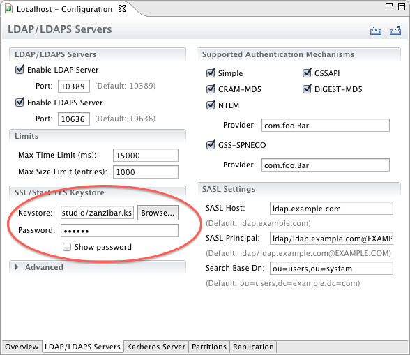

重启服务器后就可以使用 SSL 连接服务器：

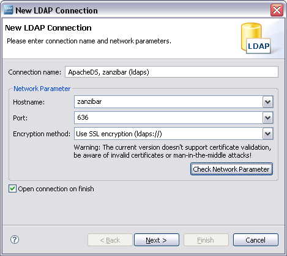

连接的行为 与 LDAP 类型，功能没有区别，但传输由 SSL 提供保护

> * 由于证书不可信，因此许多工具都会显示警告，你可能查看证书，并且决定继续就好
> * 在代码使用 SSL 连接遇到不可信证书，可能会连接使用，使用 keytool 将证书导入就好


#### 资源

- [Java Secure Socket Extension (JSSE)](https://java.sun.com/products/jsse/)
- [Portecle](https://portecle.sourceforge.net/) a free UI application for creating, managing and examining keystores
- [SSL 3.0 Specification (Netscape)](http://wp.netscape.com/eng/ssl3/)


### 4: Apache DS 集成


#### Mozilla Thunderbird 集成

* 将电子邮件和 LDAP 服务器集成是一项非常传统的任务
* 邮件程序在此刻充当普通的 LDAP 客户端，连接 LDAP 并且搜索数据（大部分复杂性对用户都是隐藏的）


邮件程序添加 LDAP 目录服务：


添加目录：


填写 LDAP 目录的基本信息：

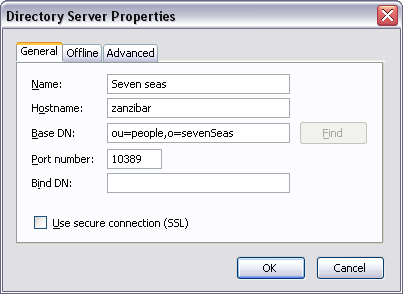

在高级搜索项里面设置：

* 查询条件最大数量
* 查询范围
* 查询结果过滤器


最终在邮件客户端中获取 LDAP 信息：

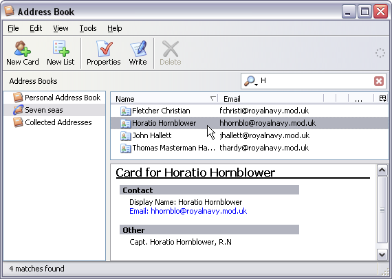


#### 资源

- [An introduction to Thunderbird](http://opensourcearticles.com/articles/introduction_to_thunderbird), Open Source Articles
- [LDAP Attribute Mapping](https://developer.mozilla.org/en-US/docs/Mozilla/Thunderbird/LDAP_Support) for Mozilla Thunderbird
